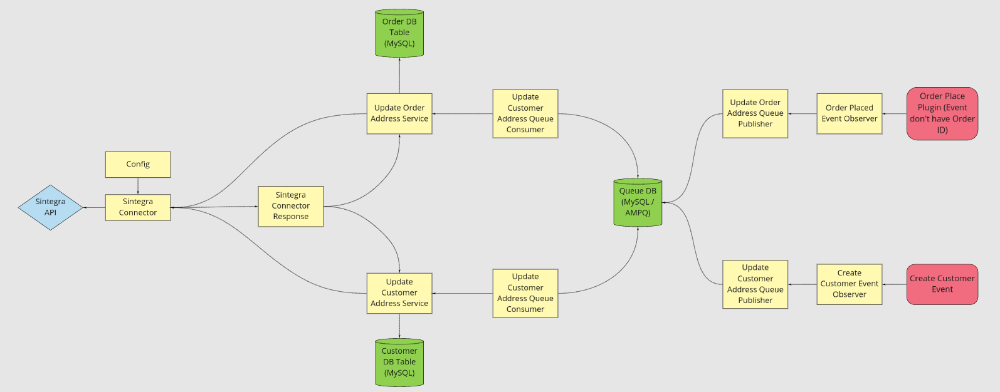

# Hibrido Customer Sintegra
A ideia desse módulo é atualizar o endereço dos clientes PJ conforme o retorno da API do Sintegra (onde enviamos o CNPJ).

## Features
* Cadastrar o endereço no cliente PJ conforme retorno do Sintegra.
* Atualizar o endereço do cliente e do pedido quando um pedido for realizado conforme retorno do Sintegra.
* Travar edição de endereço quando o cliente for PJ no Minha Conta.
* Travar edição de endereço quando o cliente for PJ no Checkout.

## Arquitetura  
* Como vamos ter a necessidade de chamar o Sintegra em vários lugares a ideia é ter um serviço para realizar essa atualização, esse serviço aceitaria apenas um CNPJ e retornaria um DataObject (do Magento) com os dados populados.
* Vamos ter que ter dois serviços principais (que serão as APIs do módulo), um para Customer e outro para Order, esses serviços chamariam por trás dos panos o serviço que comunica com o Sintegra.
* Vamos ter um Model de config, para padronizar acesso as configs do módulo.
* Não é recomendado atualizarmos o endereço da Order no momento do place, vamos trabalhar com uma configuração que permite colocarmos o ID da Order no sistema de Queue do Magento para realizar o processamento disso async (precisamos fazer config, pois em alguns casos podemos não ter o setup do sistema de queue).
* Vamos ter que fazer um Plugin para escutar a criação de um novo Customer e dependendo da config chamar o serviço do Sintegra sync ou async.
* Vamos ter que travar a edição de endereço no Minha Conta se o cliente for PJ (seguestão: travar a rota do Controller).
* Vamos ter que travar a criação de endereço no Checkout se o cliente for PJ (provavelmente só no front mesmo via JS).

## Dependências
* Hibrido Customer BR
* Magento Backend
* Magento Config
* Magento Customer
* Magento Framework
* Magento Framework MessageQueue
* Magento Store
* Psr (Log)

## Wall of Tech Debt (Melhorias To-do)
* Extrair os métodos "validateCustomer" e "getRegionId" dos Update{x}AddressesService's para uma classe que possa ser reaproveitada